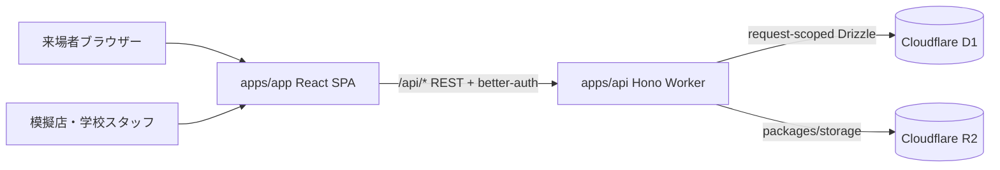

# FesFlow システム構成

最終更新: 2026-10-03。単一ドメイン設定とAPI経路は本番設定ファイルから読んだ構成であり、本番動作をこの文書だけで検証したものではない。

## コンポーネント

- `apps/app`: 来場者、サークル、イベント、システム管理者向けの React 19 / Vite SPA。静的Assetを `fesflow.shikosai.net` で配信する。
- `apps/api`: Hono REST API をCloudflare Workersで実行する。`/api/*` のルートを処理する。
- `packages/auth`: better-authのファクトリ。認証結果はAPI middlewareを経由する。
- `packages/db`: Drizzleスキーマ。各リクエストのWorker bindingからDrizzleを作る。状態をモジュールsingletonへ保持しない。
- `packages/storage`: R2ストレージ境界。
- `packages/config`: ブランド設定とHTTP/API公開契約。
- bun workspacesとTurborepoで共通依存・型検査・テスト・buildを管理する。

Cloudflare route設定は同じapexの静的Assetと`/api/*` APIを分ける。ローカルAPIは8787、SPAは3000。

## 注文確定の境界

POS注文と事前注文claimは、ルート内で認証・入力・価格・特典を確認した後、共有 `apps/api/src/services/order-commit.ts` に確定処理を委譲する。D1の対話式トランザクションは使わず、Worker APIの `batch()` に業務ガード、連番、注文、明細、在庫、スタンプ、冪等結果を含める。CHECK制約付き作業行を同じbatchで削除し、在庫・イベント・claim状態が変化した場合に全batchがrollbackする。リクエストキーと正規化入力のSHA-256を、注文と同じD1 batchで保存する。

注文番号は短いサークル接頭辞、年を含むJST日付、店舗（サークル）内の日次連番（`prefix-YYYYMMDD-NNN`）で構成する。同じ表示番号が別店舗に存在してよく、内部の注文ID（ULID）がシステム全体の識別子となる。番号検索APIもサークルIDと注文番号の組で絞る。年は同一店舗内で過去の番号検索を曖昧にしないために含める。初回の採番時は複合インデックスの範囲検索で当日の旧番号の最大値を読み、既存注文の続きから採番する。JST日付境界、前年の旧形式番号からの分離、取消後に番号を再利用しない挙動は、`apps/api/test/order-atomic.test.ts` で回帰確認する。

## スケール前提

今回の負荷条件は、5,000人が同時に注文し、その注文状態更新も集中するケース（注文作成5,000件と状態更新5,000件、合計約10,000書込み要求）とする。注文状態更新は作成後にしか実行できないため、ローカル試験では2つの連続した波として測定した。p95 2秒は質問時の仮目標で、受入SLOとしてはまだ確定していない。以前の「5〜10秒ごとに操作する」想定は比較用の仮定に留める。

D1は各DB内のquery executionが直列であり、注文のような書込み負荷をread replicaで分散できない。2026-10-03に注文作成の独立した検査をJOINし、注文番号連番を1 SQLに統合し、トッピングなし注文の空書込みを省いた。続く改善で冪等再送の照会をサークル・イベント・来場者の取得にJOINし、通常注文ごとのD1 readをさらに1回減らした。状態更新は期待する旧状態での条件更新とスタンプ付与を同一D1 batchにまとめた。さらに状態更新時の注文取得にサークルeventIdもJOINし、権限確認内で重複していたcircle検索を2回省いた。今回、全サークル共通だった注文番号suffix連番を廃止し、サークル日次連番だけを更新するようにした。初回は複合インデックスを使った同JST日の旧番号最大値照会で採番を継続する。在庫管理対象がない注文では0行更新となるメニュー在庫SQLをbatchに含めない。

最適化後のローカルworkerd/D1エミュレーター試験では、実API `POST /api/orders` に5,000件の同時要求（個別の冪等キー、在庫無効・トッピングなしの単品注文）を送り、全件成功・11.95秒完了（p95 11.91秒、約418件/秒）だった。冪等性照会とコンテキスト取得を1 readにまとめた測定では、全件成功・10.58秒完了（p50 10.49秒、p95 10.53秒、p99 10.53秒、約473件/秒）となった。グローバルsuffix連番の除去と旧番号からの初回継続を含む測定は全件成功し、p95は12.27秒と15.78秒だった。在庫管理対象がない注文から空のメニュー在庫UPDATEも省いた最終コードでは、5,000件全て成功、13.94秒完了（p50 13.81秒、p95 13.89秒、p99 13.89秒）だった。直前測定のp95 15.78秒より約12%短いものの、単一回の比較で揺れが大きく、先行の10.53秒も下回っていないため、性能改善の結論は保留する。注文状態更新のHTTP経路では、同一circle_managerセッションから異なる5,000注文へPATCHし、全件成功・16.89秒（p95 16.83秒）だった。イベントIDの再利用で権限内のcircle検索を2回省く変更前の同条件は20.93秒（p95 20.88秒）で、p95は約19%短縮した。この状態更新試験は1セッションを使い、5,000個の別ユーザーセッションを再現したものではない。更新サービスを直接呼ぶD1層の測定は全件成功・1.91秒（p95 1.89秒、約2,616件/秒）であり、HTTP認証・権限確認・Worker全経路を含まない。先行する最大同時実行200の403ms測定は条件が一致していないため、今回の同時開始試験とは直接比較しない。

これらはローカルworkerd測定であり、Cloudflare本番容量や実際のD1 queue挙動を保証しない。注文作成・状態更新のAPI p95はいずれも仮目標2秒を大きく超えるため、現構成が要件を満たすとは判断できない。単一D1のローカル最適化だけでは目標に届かず、read replica単独も書込み解消策にならない。注文番号の共有suffix連番は除去し、在庫管理対象がない注文では不要な在庫UPDATEを送らないようにした。追加性能は一度の比較で約12%短縮したが、測定の揺れが大きく結論づけられない。次のD1内調査では、注文確定batch内の各SQL実行時間、D1の実測queue待ち、同一商品の在庫競合とサークル分布を分けて確認する。

本番の負荷試験は未実施。専用試験データ、実施時間帯、停止条件を相談して確定するまで実施しない。継続判断ではCloudflare上のD1 write QPS/latency、Worker応答時間とエラー率、在庫・注文整合性を観測する。書込みストレージ比較後、ユーザーはD1の追加最適化を続ける方針を選択した。次段階では注文確定batch内のSQL実行時間、実D1のqueue待ち、同一商品の在庫競合、サークルごとの注文分布を計測し、残るボトルネックを絞る。

## 書込みストレージ比較（2026-10-03）

比較条件は5,000人が同時に注文し、その後に5,000件の状態更新が集中する想定とする。注文確定では注文番号の一意性、在庫の競合防止、注文・明細・在庫・事前注文claim・スタンプ・冪等キーの原子性が必要であり、これらを失う構成は候補にしない。

| 選択肢 | 同時書込みと整合性 | このシステムでの評価 |
| --- | --- | --- |
| 現行D1 | 1つのD1データベースはクエリを直列処理する。`batch()` の注文確定は原子的だが、単一DBの書込み列そのものは並列化しない。read replicaは読み取り用。 | 追加最適化の余地は残るが、測定した注文API p95 10.53〜15.78秒から2秒仮目標を満たす根拠はない。需要が落ち着く、またはSLOを緩める場合は移行コストを避けられる。 |
| Durable Objects (SQLite) | オブジェクトごとに強整合・transactional storageを持つ。データは一意のオブジェクトに閉じる。異なるオブジェクトには分散できるが、同じオブジェクトの状態調整を並行化する仕組みではない。 | サークル単位に分ければ複数サークルの負荷を分散できる可能性がある。同一サークルや同一在庫を5,000人が競合する場合は単一オブジェクトに集中する。注文、共有ユーザー、事前注文を分割したときの横断整合性も新設計が必要。 |
| PostgreSQL + Hyperdrive | HyperdriveはWorkerから外部PostgreSQLへ接続するグローバル接続プール。並行実行能力は接続先PostgreSQLの構成とロック競合で決まり、HyperdriveだけではDB容量や行ロック競合を解消しない。PostgreSQL側のトランザクションで注文確定処理をまとめられる。 | 高い同時書込みに合わせてDB compute・接続数・インデックスを調整する設計候補。反面、DB運用費、監視・バックアップ、接続ドライバー対応、D1からのデータ移行と切戻しを引き受ける。実負荷測定前に性能達成を保証できない。 |

比較調査時点ではPostgreSQL + Hyperdriveの限定プロトタイプを提案したが、ユーザーはD1の追加最適化を続ける方針を選択した。したがって、現時点ではD1を使い続け、ローカル計測と本番で承認済みの負荷試験条件がそろった後に再評価する。将来PostgreSQLへ移行する場合も、同じAPI契約、注文・在庫・冪等テスト、実測の負荷分布で性能・費用・運用責任を比較してから移行する。D1とPostgreSQLへの二重書込みは原子性を損なうため、検証以外での並行運用はしない。

この比較は設計調査であり、PostgreSQL事業者や容量、p95 2秒の受入SLO、会場間の注文分布、移行方式は未決。Cloudflare本番の負荷試験・データ書込みは行っていない。

## 確定する設定と未決の判断

- 認証レート制限はIP単位を使わず、要求に含まれるメール/パスキー識別子ごとに失敗を記録する。待機は1秒から倍々で延ばし最大60秒とする。Google OAuth開始時にはログインIDがWorkerに届かないため、識別子別遅延の対象外となる。
- scheduled cleanupは60日という既存値を候補期限として保持し、ended/archivedだけを対象にする。学校・会計規程確認までは `CLEANUP_ENABLED` を設定せずdry-runに留める。保持期間・対象行・有効化日は未決。
- API成功アクセスログは既定1%サンプル、エラーは全件。URL・query・body・cookie・送信IPを含めず、route templateとrequest ID、status、所要時間を記録する。
- `REQUEST_LOG_SAMPLE_RATE`、`CLEANUP_ENABLED`、`CLEANUP_DRY_RUN=true` は任意のCloudflare binding。イベントデータ削除は `CLEANUP_ENABLED=true` を明示した場合だけ実行できる。本番環境値は今回変更していない。

詳しい手順: [ローカル開発](DEVELOPMENT.md)、[本番リリース](DEPLOY.md)、[運用・承認待ち](OPERATIONS.md)。
