# FesFlow データベース ER図

FesFlow (旧 FesOrder) における Cloudflare D1 データベース (Drizzle ORM) のテーブル設計およびリレーションのドキュメントです。
本システムはシステム管理、イベント管理、サークル（出店）管理、来場者マイページ、および認証（Better-Auth標準）のデータ構造で構成されています。

## ER図 (Mermaid)

```mermaid
erDiagram
    %% ==========================================
    %% 認証（Better-Auth標準）
    %% ==========================================
    user ||--o{ session : "has"
    user ||--o{ account : "has"
    
    user {
        text id PK
        text name
        text email UK
        integer emailVerified "boolean"
        text image
        integer createdAt "timestamp"
        integer updatedAt "timestamp"
    }
    session {
        text id PK
        integer expiresAt "timestamp"
        text token UK
        integer createdAt "timestamp"
        integer updatedAt "timestamp"
        text ipAddress
        text userAgent
        text userId FK "user.id"
    }
    account {
        text id PK
        text accountId
        text providerId
        text userId FK "user.id"
        text accessToken
        text refreshToken
        text idToken
        integer accessTokenExpiresAt
        integer refreshTokenExpiresAt
        text scope
        text password
        integer createdAt "timestamp"
        integer updatedAt "timestamp"
    }
    verification {
        text id PK
        text identifier
        text value
        integer expiresAt "timestamp"
        integer createdAt "timestamp"
        integer updatedAt "timestamp"
    }

    %% ==========================================
    %% イベント・サークル・メニュー（コア）
    %% ==========================================
    event ||--o{ circle : "has"
    circle ||--o{ menu : "has"
    circle ||--o{ topping : "has"
    menu ||--o{ menu_topping : "has"
    topping ||--o{ menu_topping : "has"
    circle ||--o{ staff : "has"
    
    event ||--o{ membership : "belongs_to"
    circle ||--o{ membership : "belongs_to"
    
    event ||--o{ invite_token : "associated_with"
    circle ||--o{ invite_token : "associated_with"

    event {
        text id PK
        text eventName
        text description
        integer startDate "timestamp"
        integer endDate "timestamp"
        text logoUrl
        text fontFamily
        text customFontUrl
        text primaryColor
        text primaryTextColor
        text accentColor
        text accentTextColor
        text backgroundColor
        text textColor
        integer deletedAt "timestamp (logical delete)"
        integer createdAt "timestamp"
        integer updatedAt "timestamp"
    }
    circle {
        text id PK
        text eventId FK "event.id"
        text name
        text description
        text password
        text iconImagePath
        text backgroundImagePath
        text mods "JSON"
        text settings "JSON"
        text stampSecret
        integer deletedAt "timestamp (logical delete)"
        integer createdAt "timestamp"
        integer updatedAt "timestamp"
    }
    menu {
        text id PK
        text circleId FK "circle.id"
        text name
        integer price
        text imagePath
        text description
        text additionalInfo
        integer soldOut "boolean"
        integer stockQuantity
        integer createdAt "timestamp"
        integer updatedAt "timestamp"
    }
    topping {
        text id PK
        text circleId FK "circle.id"
        text name
        integer price
        text description
        integer soldOut "boolean"
        integer createdAt "timestamp"
        integer updatedAt "timestamp"
    }
    menu_topping {
        text id PK
        text menuId FK "menu.id"
        text toppingId FK "topping.id"
        integer createdAt "timestamp"
    }
    staff {
        text id PK
        text circleId FK "circle.id"
        text name
        integer shiftStart "timestamp"
        integer shiftEnd "timestamp"
        integer createdAt "timestamp"
        integer updatedAt "timestamp"
    }
    membership {
        text id PK
        text userEmail
        text userName
        text circleId FK "circle.id (nullable)"
        text eventId FK "event.id (nullable)"
        text role
        text pin
        integer isActive "boolean"
        integer invitedAt "timestamp"
        integer acceptedAt "timestamp"
        integer createdAt "timestamp"
        integer updatedAt "timestamp"
    }
    invite_token {
        text id PK
        text token UK
        text circleId FK "circle.id (nullable)"
        text eventId FK "event.id (nullable)"
        text role
        integer maxUses
        integer usedCount
        integer expiresAt "timestamp"
        text createdBy
        text targetEmail
        integer createdAt "timestamp"
    }

    %% ==========================================
    %% 注文・来場者・スタンプラリー・抽選（来場者向け・売上管理）
    %% ==========================================
    circle ||--o{ orders : "has"
    orders ||--o{ order_item : "contains"
    menu ||--o{ order_item : "references"
    order_item ||--o{ order_item_topping : "has"
    topping ||--o{ order_item_topping : "references"

    event ||--o{ event_user : "registers"
    event_user ||--o{ wristband : "wears"
    
    event_user ||--o{ pre_order : "places"
    circle ||--o{ pre_order : "receives"
    pre_order ||--o{ pre_order_item : "contains"
    menu ||--o{ pre_order_item : "references"

    event_user ||--o{ circle_visit : "visits"
    circle ||--o{ circle_visit : "visited_at"

    event_user ||--o{ numbered_ticket : "holds"
    circle ||--o{ numbered_ticket : "issues"

    event_user ||--o{ review : "writes"
    circle ||--o{ review : "receives"

    circle ||--o{ user_stamp : "stamped_at"

    event ||--o{ lottery : "manages"
    lottery ||--o{ lottery_prize : "offers"
    lottery ||--o{ lottery_entry : "has"
    event_user ||--o{ lottery_entry : "submits"
    lottery ||--o{ lottery_winner : "has"
    lottery_prize ||--o{ lottery_winner : "wins"
    event_user ||--o{ lottery_winner : "wins"

    orders {
        text id PK
        text userId "anonymous_id"
        text circleId FK "circle.id"
        text orderNumber UK
        integer peopleCount
        integer totalPrice
        text status "pending/preparing/completed/cancelled"
        integer completed "boolean"
        integer completedAt "timestamp"
        integer estimatedTime "minutes"
        text cashierId
        integer createdAt "timestamp"
        integer updatedAt "timestamp"
    }
    order_item {
        text id PK
        text orderId FK "orders.id"
        text menuId FK "menu.id"
        text menuName "snapshot"
        integer menuPrice "snapshot"
        integer quantity
        integer createdAt "timestamp"
    }
    order_item_topping {
        text id PK
        text orderItemId FK "order_item.id"
        text toppingId FK "topping.id"
        text toppingName "snapshot"
        integer toppingPrice "snapshot"
        integer createdAt "timestamp"
    }
    event_user {
        text id PK
        text eventId FK "event.id"
        integer displayId "sequential"
        text status "available/banned"
        text nickname
        text favorite_date "YYYY-MM-DD (旧 birthday)"
        integer onboardedAt "timestamp"
        integer createdAt "timestamp"
        integer updatedAt "timestamp"
    }
    wristband {
        text id PK "physical_code/QR"
        text userId FK "event_user.id"
        text status "active/lost/replaced/revoked"
        integer assignedAt "timestamp"
        integer deactivatedAt "timestamp"
    }
    pre_order {
        text id PK
        text userId FK "event_user.id"
        text circleId FK "circle.id"
        integer totalPrice
        text status "pending/checked_in/completed/cancelled"
        integer createdAt "timestamp"
        integer updatedAt "timestamp"
    }
    pre_order_item {
        text id PK
        text preOrderId FK "pre_order.id"
        text menuId FK "menu.id"
        integer quantity
        integer createdAt "timestamp"
    }
    circle_visit {
        text id PK
        text eventUserId FK "event_user.id"
        text circleId FK "circle.id"
        text staffId
        integer createdAt "timestamp"
    }
    numbered_ticket {
        text id PK
        text circleId FK "circle.id"
        text eventUserId FK "event_user.id"
        integer slotStart "timestamp"
        text slotLabel
        text status "issued/used/expired/cancelled"
        text issuedByStaffId
        integer createdAt "timestamp"
        integer updatedAt "timestamp"
    }
    review {
        text id PK
        text eventUserId FK "event_user.id"
        text circleId FK "circle.id"
        integer rating "1-5"
        text comment
        integer createdAt "timestamp"
    }
    user_stamp {
        text id PK
        text userId "anonymous_id"
        text circleId FK "circle.id"
        integer createdAt "timestamp"
    }
    reward_redemption {
        text id PK
        text userId UK "anonymous_id"
        text staffId
        integer createdAt "timestamp"
    }
    lottery {
        text id PK
        text eventId FK "event.id"
        text name
        integer drawAt "timestamp"
        text status "open/drawn/closed"
        integer createdAt "timestamp"
    }
    lottery_prize {
        text id PK
        text lotteryId FK "lottery.id"
        text name
        integer quantity
    }
    lottery_entry {
        text id PK
        text lotteryId FK "lottery.id"
        text eventUserId FK "event_user.id"
        integer createdAt "timestamp"
    }
    lottery_winner {
        text id PK
        text lotteryId FK "lottery.id"
        text prizeId FK "lottery_prize.id"
        text eventUserId FK "event_user.id"
        integer claimedAt "timestamp"
        integer createdAt "timestamp"
    }
    notification {
        text id PK
        text userEmail
        text title
        text message
        text type
        text status "unread/read"
        text circleName
        text eventName
        text token
        text role
        integer createdAt "timestamp"
    }
```

---

## 各テーブル詳細定義 (データ型および説明)

Drizzle ORM で記述されている `auth.ts` / `festival.ts` のテーブルスキーマの概要です。

### 1. 認証関連テーブル (Better-Auth 準拠)

#### `user` (ユーザー)
管理ポータルなどのスタッフ・管理者アカウント用のテーブルです（来場者用 `event_user` とは別）。
- **`id` (text, PK)**: ユーザーの一意識別子。
- **`name` (text)**: ユーザーの表示名。
- **`email` (text, Unique)**: ユーザーのメールアドレス。
- **`emailVerified` (integer/boolean)**: メール認証完了フラグ。
- **`image` (text, Nullable)**: プロフィール画像のURL。

#### `session` (セッション)
認証ユーザーのセッションセッション情報。
- **`userId` (text, FK)**: `user.id` に紐付き、物理削除時は CASCADE。

#### `account` (アカウント)
ソーシャルログイン (OAuth) やパスワード認証の情報。
- **`userId` (text, FK)**: `user.id` に紐付き、物理削除時は CASCADE。

#### `verification` (ワンタイム確認)
メールアドレス確認やパスワードリセットなどの検証用トークン。

---

### 2. イベント・サークル・メニュー（コア）

#### `event` (イベント / 文化祭全体)
文化祭やイベントそのものを管理するマスタ。テーマカラーなどのカスタムデザイン設定も保持します。
- **`deletedAt` (integer/timestamp, Nullable)**: 論理削除用カラム。

#### `circle` (サークル / 出店店舗)
各模擬店や出展ブース。設定や拡張モジュール設定をJSON文字列で管理します。
- **`eventId` (text, FK)**: 所属イベント。
- **`settings` (text)**: 拡張モジュールの切り替え（在庫、スタッフ管理等）を保持するJSON。
- **`stampSecret` (text, Nullable)**: スタンプラリーでのQR OTP（ワンタイムパスワード）スタンプ用シークレット。

#### `menu` (メニューアイテム)
店舗が提供するメニュー。
- **`circleId` (text, FK)**: 所属サークル。
- **`stockQuantity` (integer)**: 拡張機能で使用する在庫数。

#### `topping` (トッピング)
メニューに追加可能なトッピング。
- **`circleId` (text, FK)**: 管理サークル。

#### `menu_topping` (メニューとトッピングの中間テーブル)
どのメニューにどのトッピングを紐づけるかの中間マスタ。

#### `staff` (スタッフシフト)
サークルのスタッフ名および稼働シフト時間の管理。

#### `membership` (管理者メンバーシップ)
`user` に対するイベントおよびサークルでの操作ロール (`super_admin` / `event_manager` / `circle_manager` / `circle_staff` 等) を紐づけるマルチテナントの中心となる中間テーブル。
- **`userEmail` / `userName`**: 招待時に指定するメールアドレスと名前。

#### `invite_token` (招待トークン)
メンバーシップへの招待URLに含める使い捨てまたは複数回利用可能トークン。

---

### 3. 注文・来場者・スタンプラリー・抽選（来場者向け・売上管理）

#### `orders` (注文メイン)
店頭のレジ端末でスキャンされて作成された注文トランザクション。
- **`userId` (text, Nullable)**: 紐付けられた来場者ID。
- **`status` (text)**: 注文状態 (`pending`, `preparing`, `completed`, `cancelled`)。

#### `order_item` (注文明細)
注文された商品。価格や名前は注文時点のスナップショットを保持します。

#### `order_item_topping` (注文明細トッピング)
注文された商品に付加されたトッピングのスナップショット。

#### `event_user` (イベント来場者 / ゲスト)
リストバンドQRから初回アクセス時に作成される来場者マイページ用のユーザー。
- **`displayId` (integer)**: 呼出用の連番（イベントごとにユニーク）。
- **`nickname` / `favorite_date`**: リストバンド紛失・再発行の本人照合用プロフィール（「お好きな日付」として収集）。

#### `wristband` (リストバンド)
物理リストバンドQRと `event_user` を結びつける。紛失時の再発行履歴を追跡できるよう 1:N 構造になっています。
- **`status` (text)**: `active`, `lost`, `replaced`, `revoked`。

#### `pre_order` (事前注文)
来場者がマイページから事前に予約するオーダー。

#### `pre_order_item` (事前注文明細)
事前オーダーされたメニューと数量。

#### `circle_visit` (サークル訪問ログ)
店頭レジ等でスキャンされたときの体験ログ。抽選の応募条件などに使用されます。

#### `numbered_ticket` (整理券)
混雑防止のために発行される時間帯指定の整理券。

#### `review` (レビュー)
体験したサークルに対する5段階評価とコメント（1人1サークル1件制限）。

#### `user_stamp` (スタンプラリー記録)
スタンプ押印ログ。サークルごとに1つ獲得可能。

#### `reward_redemption` (景品交換記録)
スタンプラリー制覇による景品交換の完了記録（1人1回まで）。

#### `lottery` (抽選イベント)
イベント主催者が実行する抽選会マスタ。

#### `lottery_prize` (抽選景品)
各抽選会における景品名と当選上限数。

#### `lottery_entry` (抽選応募)
来場者が抽選にエントリーした記録。

#### `lottery_winner` (抽選当選結果)
どのユーザーにどの景品が当選したかの記録。
